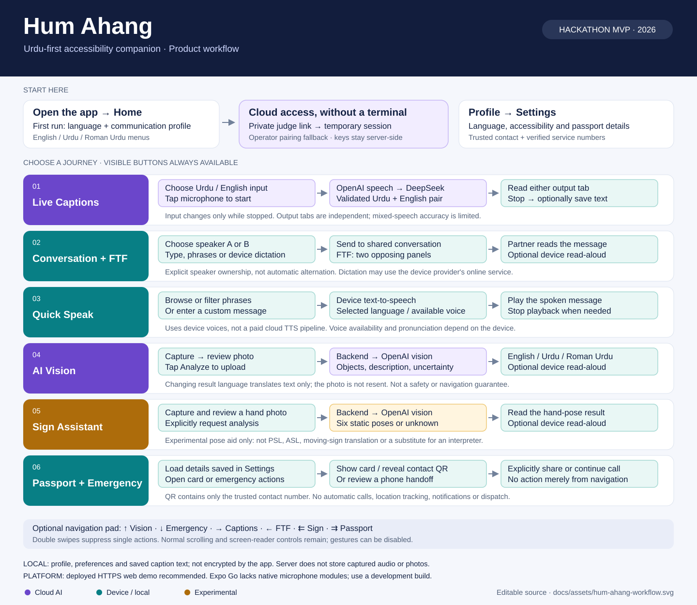
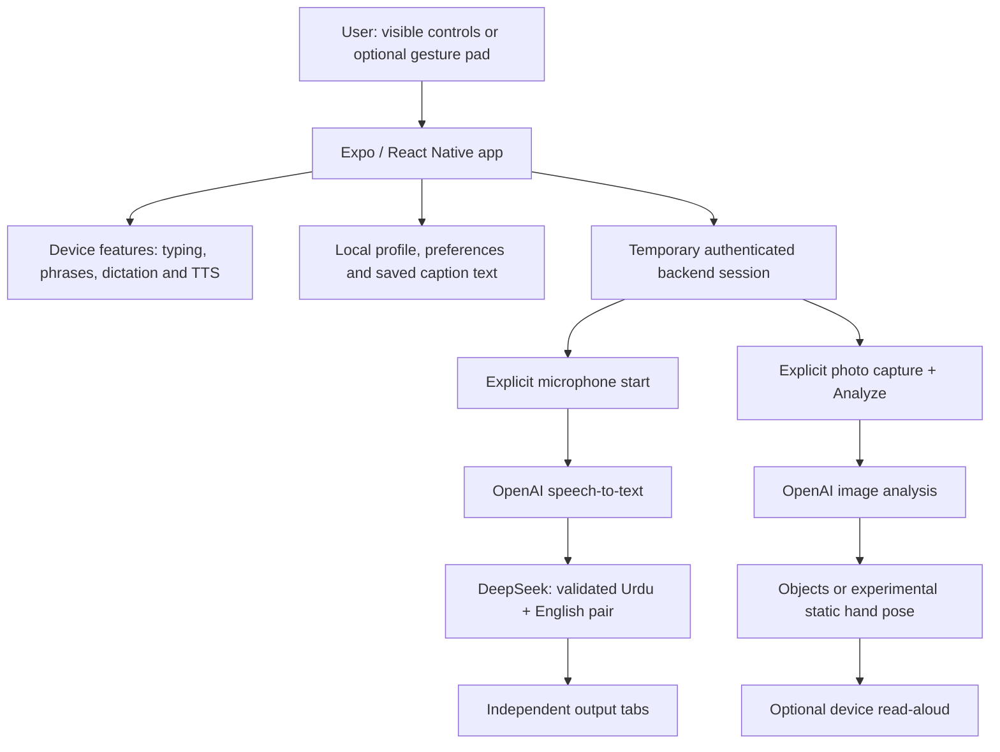

# Hum Ahang workflow

A source-checked map of the hackathon MVP, updated 8 September 2026. This describes implemented behavior, not a promise of complete sign translation or emergency response.

[Open the full-size, editable SVG](assets/hum-ahang-workflow.svg).

## Entry and shared settings

Open the [deployed HTTPS app](https://humahang-production.up.railway.app). First-run onboarding selects the interface language and communication profile. Home provides visible navigation; Profile → Settings owns language, accessibility preferences, passport details, trusted contact and service numbers.

Cloud features require a temporary authenticated session. The **private judge link supplied separately** exchanges its invitation for an in-memory grant lasting at most one hour. It does not start the microphone, camera or a paid analysis. Operator pairing remains a fallback. Never put the private invitation or API keys in this repository. See [judge access](judge-access.md) for expiry, renewal and usage limits.

## Six feature journeys

| Journey | User action → processing → result | Important boundary |
| --- | --- | --- |
| Live Captions | Choose Urdu or English input while stopped → start microphone → backend OpenAI STT → DeepSeek validates paired Urdu/English output → read either tab → stop and optionally save | Output tabs are independent of input language. Every finalized segment is processed for the pair; mixed speech remains imperfect. Saving stores displayed text, not audio. |
| Conversation and face-to-face | Select speaker A/B → type, choose phrases or review device dictation → send → partner reads or uses device read-aloud | FTF uses the same conversation with two opposing panels. Sender ownership is explicit, never automatically alternated. This is shared-device communication, not remote messaging. |
| Quick Speak | Filter/select a phrase or enter text → device text-to-speech → hear/stop playback | Voice support depends on the operating system. No cloud TTS API is required. |
| AI Vision | Capture and review → explicitly Analyze → authenticated backend sends photo to OpenAI → read objects/description → optionally listen | English/Urdu/Roman Urdu result controls translate only result text through OpenAI and cache translations per photo; they do not upload the photo again. |
| Sign Assistant | Capture a hand photo → explicitly analyze through OpenAI → static pose result or unknown → optionally listen | Six poses: open palm, closed fist, thumbs up, thumbs down, victory and pointing up. **Not PSL/ASL or moving-sign translation.** |
| Passport and Emergency | Load Settings-owned details → display communication card, reveal contact-number QR, speak help or review phone handoff → explicitly share/call | Sharing opens a preview/device share flow. The QR contains only the trusted contact number, not the whole passport. No automatic calls, location tracking or dispatch. |

## Processing architecture

OpenAI is the current caption recognizer. Deepgram remains an **explicit operator rollback**, not an automatic fallback or audio replay. Conversation/FTF dictation is a separate device/browser recognition path, not the cloud caption pipeline.

## Gesture areas

Navigation shortcuts work only inside the expanded, dedicated navigation pad:

| Gesture | Destination |
| --- | --- |
| Swipe up | AI Vision |
| Swipe down | Emergency |
| Swipe right | Live Captions |
| Swipe left | Face-to-face |
| Double swipe left | Sign Assistant |
| Double swipe right | Passport |

Double swipes do not also trigger single-swipe navigation. Normal page scrolling stays separate. Visible buttons and screen-reader support remain available; gestures can be disabled in Settings.

Live Captions has a **different, local input-language area**: left selects English, right selects Urdu. Its tappable controls and voice indication provide alternatives. Input changes are allowed only while recording is stopped. These gestures do not navigate and do not change the output tab.

## Data, safety and MVP limits

- Provider credentials stay on the backend. Judge sessions are temporary; refresh, expiry or server restart may require reopening the original private invitation.
- Local profile/preferences and saved caption text are not encrypted by this app or synced across devices.
- The server does not record/store captured audio or photos. Cloud providers process explicitly submitted content; device capture caches and provider retention are separate concerns.
- Photo analysis is an assistive description, not safe-navigation or emergency advice. Unknown/uncertain results must not be treated as certainty.
- Opening Emergency or Passport does not call, share, reveal a QR or request camera/microphone permission automatically.
- Emergency service numbers must be configured and verified for the user's area. The app cannot confirm that a call connected.
- Expo Go previews the interface but lacks required native microphone modules. Use the deployed HTTPS browser app or a native development build. Browser mic access requires HTTPS or localhost.
- Device/browser recognition may use an online service; device features are not a guarantee of offline operation.
- Ordinary conversation history, smart replies and broader AI actions are not represented here as finished capabilities.

## Implementation references

[Caption migration](openai-stt-migration.md) · [Caption contract](live-captions-bilingual-output.md) · [Photo features](vision-qa.md) · [Passport contract](passport-contract.md) · [Emergency contract](emergency-contract.md) · [Gesture contract](navigation-gestures.md) · [QA guide](qa-guide.md).

